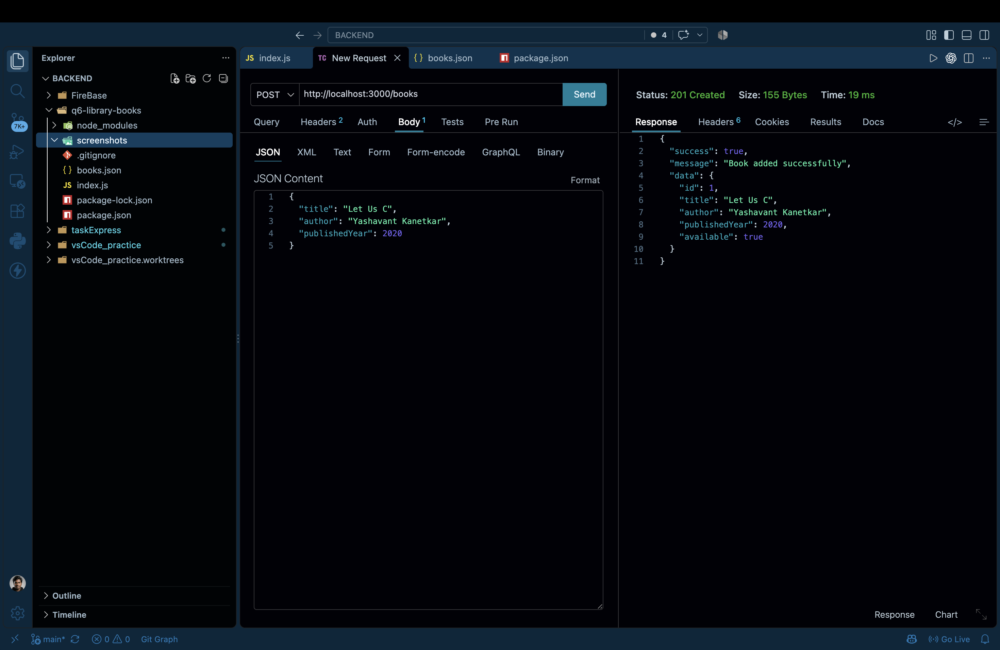
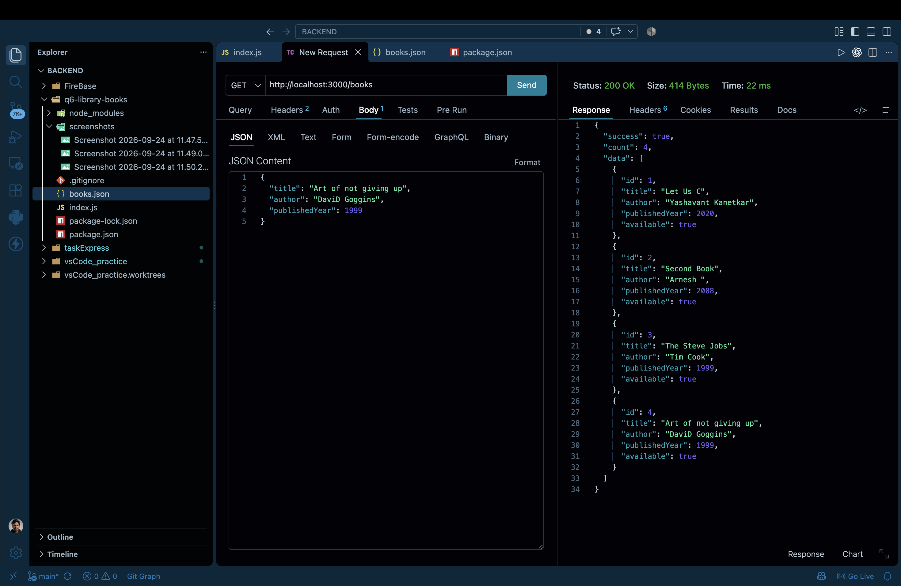
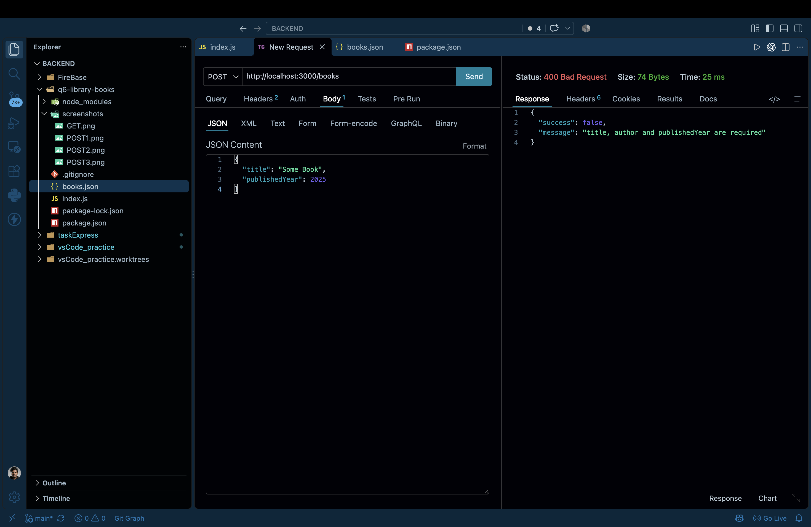
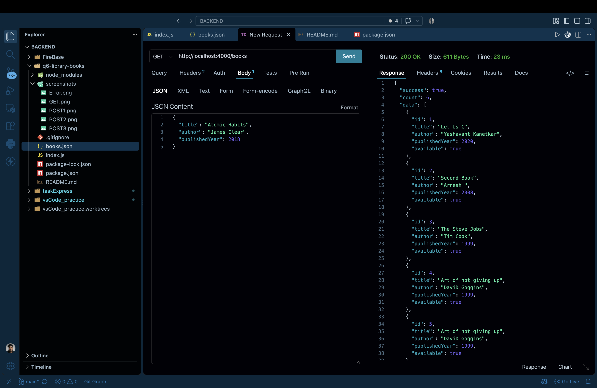

# Q6 - Library Books API

This project is a simple Express.js API for adding and viewing books.

The books are stored in a JSON file (`books.json`) instead of using a database.

## Features

- Add books using `POST /books`
- Get all books using `GET /books`
- Stores books permanently in `books.json`
- Automatically generates a numeric `id`
- Automatically sets `available` to `true`
- Checks that title, author and publishedYear are provided

## Project Structure

```text
q6-library-books/
│
├── index.js
├── books.json
├── package.json
├── package-lock.json
├── README.md
├── .gitignore
└── screenshots/
    ├── post-201.png
    ├── get-books.png
    ├── validation-400.png
    └── persistence.png
````

## How to Run

### 1. Install dependencies

```bash
npm install
```

### 2. Start the server

```bash
npm run server
```

The server runs on:

```text
http://localhost:4000
```

## API Endpoints

### POST /books

Used to add a new book.

URL:

```text
http://localhost:4000/books
```

Example request:

```json
{
  "title": "Let Us C",
  "author": "Yashavant Kanetkar",
  "publishedYear": 2020
}
```

Example response:

```json
{
  "success": true,
  "message": "Book added successfully",
  "data": {
    "id": 1,
    "title": "Let Us C",
    "author": "Yashavant Kanetkar",
    "publishedYear": 2020,
    "available": true
  }
}
```

The server creates the `id` and `available` fields automatically.

### GET /books

Used to get all books stored in `books.json`.

URL:

```text
http://localhost:4000/books
```

Example response:

```json
{
  "success": true,
  "count": 3,
  "data": [
    {
      "id": 1,
      "title": "Let Us C",
      "author": "Yashavant Kanetkar",
      "publishedYear": 2020,
      "available": true
    }
  ]
}
```

## Validation

If `title`, `author` or `publishedYear` is missing, the API returns:

```text
400 Bad Request
```

Example:

```json
{
  "title": "Some Book",
  "publishedYear": 2026
}
```

Response:

```json
{
  "success": false,
  "message": "title, author and publishedYear are required"
}
```

## Data Storage

All books are stored in:

```text
books.json
```

When a new book is added, the server:

1. Reads the existing books.
2. Converts the JSON data into an array.
3. Adds the new book.
4. Writes the updated array back to `books.json`.

Because the data is stored in the file, previously added books remain after restarting the server.

## Screenshots

### POST /books - 201 Created



### GET /books



### Validation - 400 Bad Request



### Data Persistence After Server Restart



